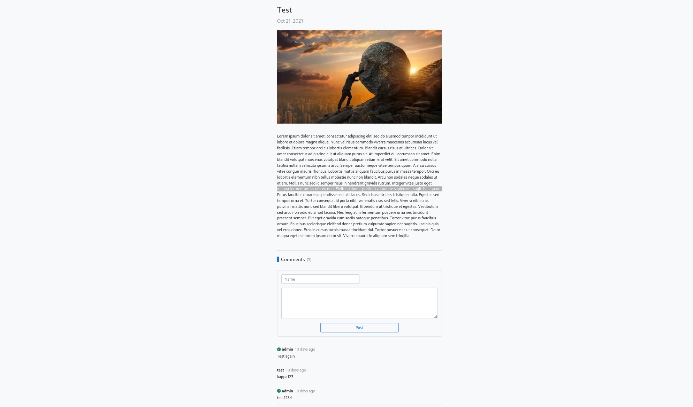

# [TheOdinProject](https://www.theodinproject.com/)

Project: Blog API

A blog developed using the MERN stack and RESTful API.

Using Bootstrap as a CSS framework and JWT for authentication.

Backend is deployed with Heroku.

## Features

- Personal blog
- Jamstack app
- Token authentication

## Installation

This app uses environment variables and is not meant to be installed. Please visit the demo site or view source code to know more about details.

## Demo

[Live Demo](https://alberinea.github.io/blog-api/)
